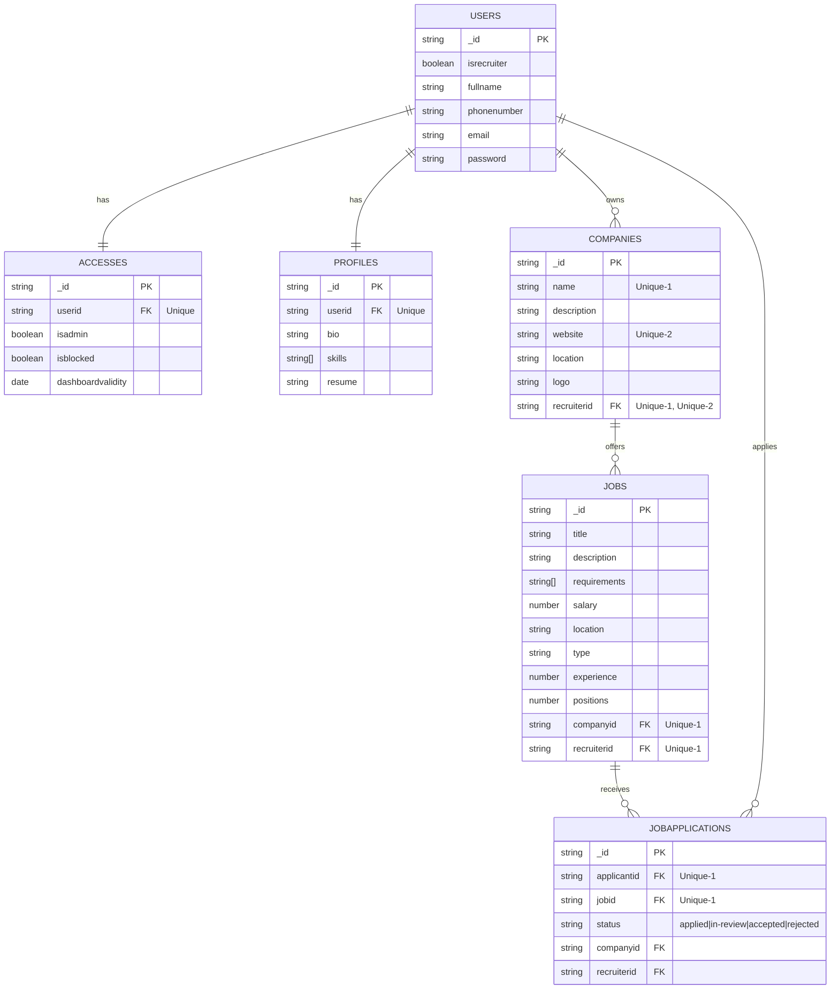
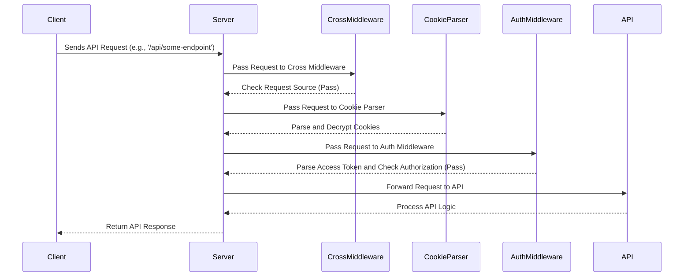
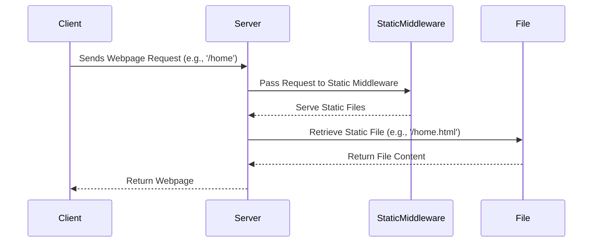
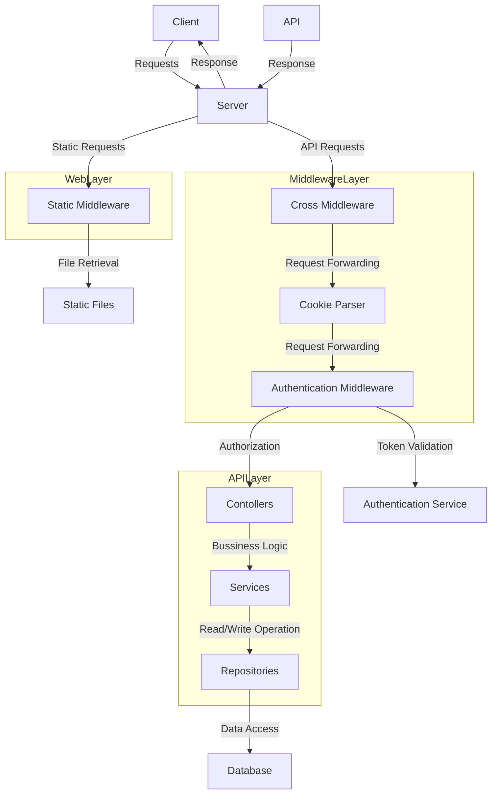
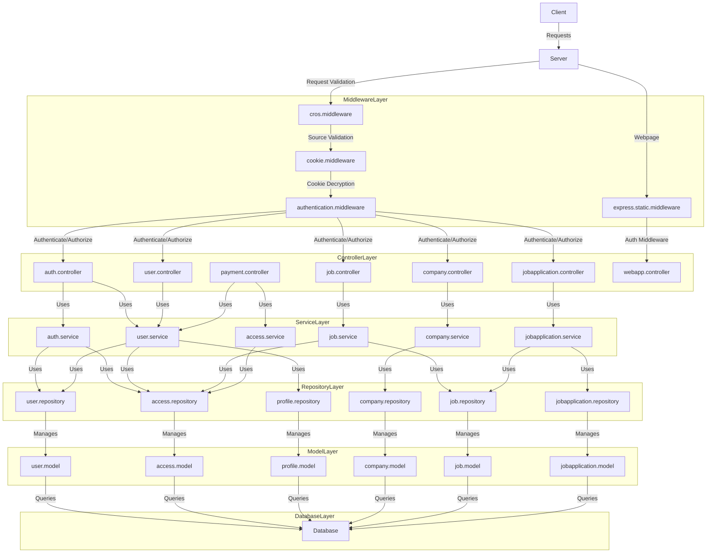

# JobRambo

> Better naming conventions, better-layed modules, separation of operations
> 

> Better security guidelines, json webtoken with live access authorization, http-only token, encrypted and https only cookie
> 

> Better database optimization split into atomic tables for limited works, enhanced indexation and validations
> 

Architecture